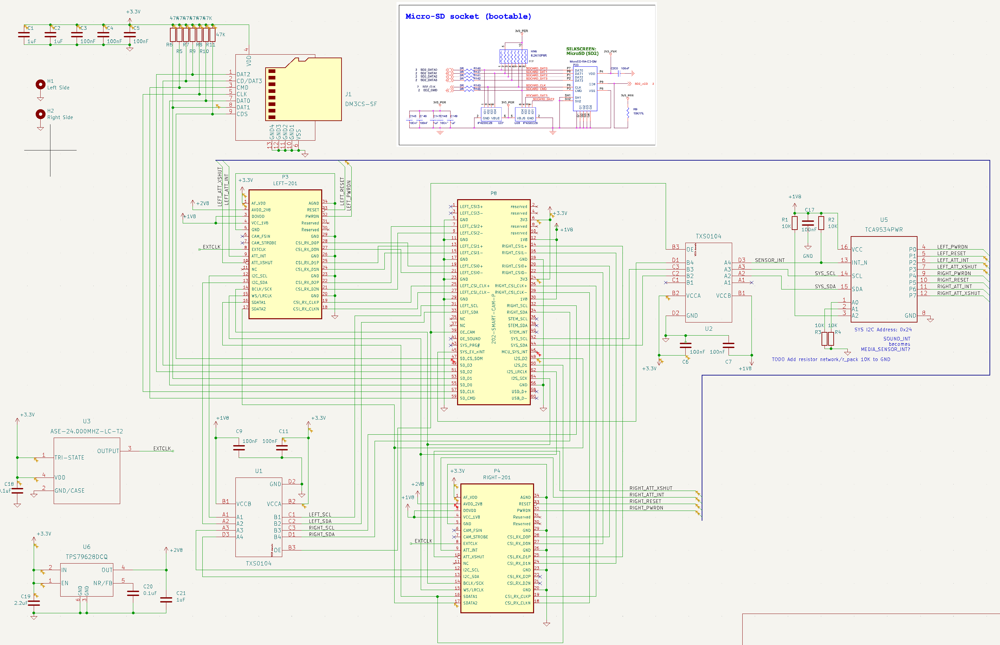

# 202 Combi Camera Module

The board
- 18mm x 57mm, 25mm wide hole for the T-USB module, 3.5mm bridge between the parts 
- 1 * 60 pin connector
- 2 * 34 pin connectors
- 34 pin connectors are 4.25 mm from bottom
- 34 pin connector centers are 51 mm apart
- 

## BOM

- 1 * [XTAL OSC 24MHz ASE-24.000MHZ-LC-T]() - [Mouser](https://www.mouser.ch/ProductDetail/ABRACON/ASE-24.000MHZ-LC-T) - 1.2mm height - [Datasheet](https://abracon.com/Oscillators/ASEseries.pdf) - In stock
- 1 * [LDO Voltage Reg TPS79628DCQ 2.8V as SOT-223-6]() - [Mouser](https://www.mouser.ch/ProductDetail/Texas-Instruments/TPS79628DCQ) - In stock
- 1 * [IO Expander TCA9534PWR TSSOP 16 pin](https://www.ti.com/product/TCA9534) - 1.2mm height - [Datasheet](https://www.ti.com/lit/ds/symlink/tca9534.pdf) - In stock
- 1 * [Hirose Micro SD Card slot DM3CS-SF]() - [Mouser](https://www.mouser.ch/ProductDetail/Hirose-Connector/DM3CS-SF) - In stock
- 1 * [Ti Low Power MSP430 MCU MSP430FR2422IRHLR](https://www.ti.com/product/MSP430FR2422/part-details/MSP430FR2422IRHLR) - 15 GPIO - In stock
- 1 * [DF40C-60DP-0.4V]() [JLCPCB part](https://jlcpcb.com/parts/componentSearch?isSearch=true&searchTxt=DF40C-60DP-0.4V)
- 2 * [Hirose DF40C-34DS-0.4V](https://www.hirose.com/en/product/p/CL0684-4023-0-51) ([Mouser](https://www.mouser.ch/ProductDetail/Hirose-Connector/DF40C-34DS-04V51?qs=vcbW%252B4%252BSTIpg26DsEbj1iQ%3D%3D))
 

Component selection

- TPS796xx power reg vs RT8272 based on availability (Ti needs fewer components)
- TCA9534 over TCA9554 8-bit to save price. No apparent feature difference
- TCA9535 16-bit is SSOP/TSSOP in stock

Device tree and GPIO:

https://stackoverflow.com/questions/30130358/device-tree-and-gpio

## Upwork Job

You will revise my PCB design done with KiCAD v6. I have a schematic and basic PCB layout with the outline.
The board takes two connectors to camera modules and combine them into a single connector adding SD Card slot, I/O Expander, oscilator, voltage regulator and signal voltage translation.
I will want to add an MCU in the future so if you can reserve space for it on the board that will be very helpful.
I need a review for signal interference and quality of high speed signal lanes. I have not tried to route the
PCB, that will be your job.

- Correct design rules according to JLCPCB manufacturing
- Check the correctness of footprints against datasheets
- Check the need for capacitors on board reducing redundant ones
- Check that the schema/board has good ESD/noise reduction circuits
- Place resistors and capacitors where appropriate
- Update/Resolve Design checklist
- Ensure that differential pairs are routed together and balanced correctly
- Add 2 mounting holes next to P3 and P3 (symmetric)
- P3, P4 and P8 are aligned horizontally with overlapping centers
- Route the board

Symbols and footprints are found in https://github.com/experientials/kicad-lib.

