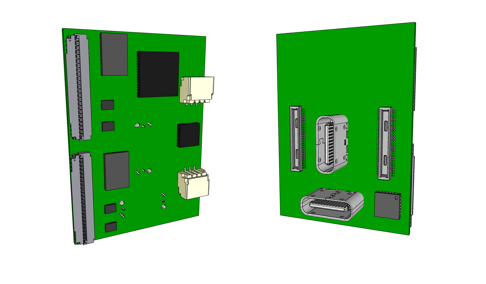

# 292 Power Module

The power module provides VSOM power to the Faceboard and routes data signals from the Faceboard through two USB plugs. A set of plugs are front facing and another set is back facing. Only one set can be used at a time.

The Power Module has three functions
- Supply the system with VSOM power
- Receive power from one of the two USB-C connectors or a LiPo battery
- Charge the connected LiPo battery
- Provide data signals from the Faceboard in the system over two USB-C connectors
- Manage autonomous system functions and waking state with the MSP430 MCU

The Power Module exposes two vertical USB-C sockets and connects to the carrier/face board through two 50 pin B2B connectors.
Two 45 pin debug connectors provides options to experiment with USB-C Alt. mode and connect a Stem MCU for Autonomous functions.
The signal voltage on the board is 3.3V.




## Components

- 2 * [50 pin connectors Hirose DF40-50DP-0.4V ](https://www.hirose.com/en/product/p/CL0684-4014-0-51) mated height 1.5mm [Mouser](https://www.mouser.ch/ProductDetail/Hirose-Connector/DF40C-50DP-04V51?qs=sGAEpiMZZMthaSLPVp%252B4asSF8eu6nRoehAaVBEWyQ6A%3D)
- 4 * [Hirose USB-C CX80B1-24P](https://www.hirose.com/product/p/CL0480-0625-0-00)
- 1 * [TPS65988](https://www.ti.com/product/TPS65988?keyMatch=TPS65988&tisearch=search-everything&usecase=GPN) Dual Port USB Type-C® and USB PD Controller, Power Switch, and High-Speed Multiplexer. [Mouser](https://www.mouser.ch/ProductDetail/Texas-Instruments/TPS65988DJRSHR?qs=sGAEpiMZZMv0NwlthflBiyrCPYKWtEb9w8lmLVKGFHI%3D)
- 1 * [MSP430 FR2032 IG56 TSSOP DGG56](https://www.ti.com/product/MSP430FR2032#tech-docs). Inventory 4870 at TI. @1000 $0.766. 52 IO pins, 1 UART/I2C, 1 UART/SPI.
- 1 * [BQ24250RGER battery charger](https://www.ti.com/product/BQ24250)  [$2 JLCPCB (4x4 mm package)](https://jlcpcb.com/parts/componentSearch?isSearch=true&searchTxt=BQ24250) [Mouser](https://www.mouser.ch/ProductDetail/Texas-Instruments/BQ24250RGER?qs=VqERlb%252BKohfBI76g9iGg8g%3D%3D)
- 2 * [3 pin JST SH socket SM03B-SRSS-TB](https://www.jst-mfg.com/product/detail_e.php?series=231) - [JLCPCB](https://jlcpcb.com/parts/componentSearch?isSearch=true&searchTxt=SM03B-SRSS-TB) - [Farnell](https://ch.farnell.com/jst-japan-solderless-terminals/sm03b-srss-tb-lf-sn/stecker-90-3kont/dp/1679118?CMP=GRHB-SF-OEM) (Matched by JST PHR-3)
- 2 * [TE Connectivity 45PIN 0.3MM 571-4-2328724-5 FPC 3-2328724-5](https://www.te.com/usa-en/product-4-2328724-5.html) $0.41
- 2 * [TPD6S300ARUKR ESD protection for USB-C port](https://www.ti.com/product/TPD6S300A/part-details/TPD6S300ARUKR)
- 2 * [HD3SS3220IRNHT  10-Gbps USB 3.1 Type-C 2:1 mux with DRP Controller](https://www.ti.com/product/HD3SS3220/part-details/HD3SS3220IRNHT) WQFN (RNH) | 30 pin 250 tray [Mouser](https://www.mouser.ch/ProductDetail/Texas-Instruments/HD3SS3220IRNHR?qs=sGAEpiMZZMsyYdr3R27aV4Thfeh8oIeSp2btOUhwC5A%3D)
- 1 * [TUSB546 Alt. Mode switch]()

Future Components

- 4 * [TS5USBC410 Dual 2:1 USB 2.0 Mux/DeMux Switch](../datasheets/USB/ts5usbc41.pdf). [Mouser](https://www.mouser.ch/ProductDetail/Texas-Instruments/TS5USBC410IYFFR?qs=sGAEpiMZZMutXGli8Ay4kPB6XEQFysSpdNErqZgdEYs%3D)


### I2C Bus

The board has 3 I2C busses. SYS, Stem and Power. Key chipsets on the board are on the Power bus, which by default is bridged onto the SYS I2C, so the two must take care to not clash on addresses. The MSP430 controls the bridge between the two and can turn it off.

Chips on the Power I2C bus

- TPS65988 PD Controller
- BQ24250 LiPo Charger
- TUSB546 Alt Mode Control
- HD3 SS3320 USB-C switch
- USB 2.0 switches
- MSP430

By default the chipsets can be controlled by Linux Device Driver Bindings(on i.MX SoM) via the SYS I2C.
The future direction is to control them by the local MSP430 MCU, which exposes information in the STEM I2C bus.

:[SYS I2C Adresses](../pinouts/SYS_I2C_ADDRESSES.md)


### GPIO exposed to SoM

- TPS65988 nINT
- TPS65988 USB-C endpoint?


## Device Tree

device tree bindings for

* [TPS65988](https://mjmwired.net/kernel/Documentation/devicetree/bindings/usb/ti,tps6598x.yaml). A variant of this controller known as Apple CD321x or Apple ACE is also present on hardware with Apple SoCs such as the M1.
* [BQ24250](https://mjmwired.net/kernel/Documentation/devicetree/bindings/power/supply/bq24257.txt)

Linux kernel support

- [BQ24250](https://git.kernel.org/pub/scm/linux/kernel/git/torvalds/linux.git/tree/drivers/power/supply/bq24257_charger.c)
- [TPS65988 Linux](https://github.com/torvalds/linux/tree/1bff7d7e8c487b9b0ceab70b43b781f1d45f55eb/drivers/usb/typec/tipd)
- [BQ2425x Linux](https://github.com/torvalds/linux/blob/master/drivers/power/supply/bq24257_charger.c)
- [Linux Getting Driver For USB Type-C DisplayPort Alternate Mode](https://www.phoronix.com/news/Linux-USB-Type-C-Port-DP-Driver)
- [API for USB Type-C Alternate Mode drivers](https://www.kernel.org/doc/html/latest/driver-api/usb/typec_bus.html)


#### TPS65988

Interrupt pin = SYS_EX_nINT

```
    i2c0 {
        #address-cells = <1>;
        #size-cells = <0>;
 
        tps6598x: tps6598x@38 {
            compatible = "ti,tps6598x";
            reg = <0x38>;
 
            interrupt-parent = <&msmgpio>;
            interrupts = <107 IRQ_TYPE_LEVEL_LOW>;
            interrupt-names = "irq";
 
            pinctrl-names = "default";
            pinctrl-0 = <&typec_pins>;
 
            // https://code.googlesource.com/linux/torvalds/linux/+/942cb357ae7d9249088e3687ee6a00ed2745a0c7/Documentation/devicetree/bindings/connector/usb-connector.yaml
            typec_con: connector {
                compatible = "usb-c-connector";
                label = "USB-C";
                port {
                    typec_ep: endpoint {
                        remote-endpoint = <&otg_ep>;
                    };
                };
            };
        };
    };
```


## Power

### Internal Power

LDO_3V3 provides up to 25mA to drive the SPI flash and other essential circuits:

LDO_3V3 budget:

- 

