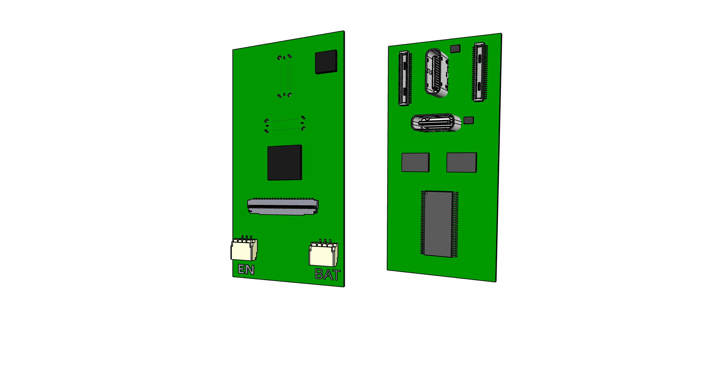

# 292 Power Module

The power module provides VSOM power to the Faceboard and routes data signals from the Faceboard through two USB plugs. A set of plugs are front facing and another set is back facing. Only one set can be used at a time.

The Power Module has specific power and data functions
- Supply the system with VSOM power
- Receive(sink role) power from OTG USB-C connector or a LiPo battery
- No need receiving(sink role) of power from Host USB-C for now
- Deliver max. 900mA to devices on Host USB
- No power delivery(source role) on OTG USB
- Charge the connected LiPo battery
- Provide Alt. Mode support on Host USB port
- Provide data signals from the Faceboard in the system over two USB-C connectors
- Manage autonomous system functions and waking state in collaboration with MSP430 MCU on faceboard

The Power Module exposes two vertical USB-C sockets and connects to the carrier/face board through two 50 pin B2B connectors.
A 45 pin connector is used to experiment with Alt. Mode over the Host USB connector.
The signal voltage on the board is 3.3V. The board can be laid out as 4 layer or 6 layer as needed.




## Components

- 2 * [50 pin connectors Hirose DF40-50DP-0.4V ](https://www.hirose.com/en/product/p/CL0684-4014-0-51) mated height 1.5mm [Mouser](https://www.mouser.ch/ProductDetail/Hirose-Connector/DF40C-50DP-04V51?qs=sGAEpiMZZMthaSLPVp%252B4asSF8eu6nRoehAaVBEWyQ6A%3D)
- 4 * [Hirose USB-C CX80B1-24P](https://www.hirose.com/product/p/CL0480-0625-0-00)
- 1 * [TPS65988](https://www.ti.com/product/TPS65988?keyMatch=TPS65988&tisearch=search-everything&usecase=GPN) Dual Port USB Type-C® and USB PD Controller, Power Switch, and High-Speed Multiplexer. [Mouser](https://www.mouser.ch/ProductDetail/Texas-Instruments/TPS65988DJRSHR?qs=sGAEpiMZZMv0NwlthflBiyrCPYKWtEb9w8lmLVKGFHI%3D)
- 1 * [W25X40CLSNIG NOR-Flash spiFlash, 4M-bit, 4Kb Uniform Sector]() - [Mouser](https://www.mouser.ch/ProductDetail/Winbond/W25X40CLSNIG) - In stock
- 1 * [BQ24250RGER battery charger](https://www.ti.com/product/BQ24250)  [$2 JLCPCB (4x4 mm package)](https://jlcpcb.com/parts/componentSearch?isSearch=true&searchTxt=BQ24250) [Mouser](https://www.mouser.ch/ProductDetail/Texas-Instruments/BQ24250RGER?qs=VqERlb%252BKohfBI76g9iGg8g%3D%3D)
- 1 * [3 pin JST SH socket SM03B-SRSS-TB](https://www.jst-mfg.com/product/detail_e.php?series=231) - [JLCPCB](https://jlcpcb.com/parts/componentSearch?isSearch=true&searchTxt=SM03B-SRSS-TB) - [Farnell](https://ch.farnell.com/jst-japan-solderless-terminals/sm03b-srss-tb-lf-sn/stecker-90-3kont/dp/1679118?CMP=GRHB-SF-OEM) (Matched by JST PHR-3)
- 1 * [3 pin JST ACH socket BM03B](https://www.jst.com/products/crimp-style-connectors-wire-to-board-type/ach-connector/)
- 2 * [TE Connectivity 45PIN 0.3MM 571-4-2328724-5 FPC 3-2328724-5](https://www.te.com/usa-en/product-4-2328724-5.html) $0.41
- 2 * [TPD6S300ARUKR ESD protection for USB-C port](https://www.ti.com/product/TPD6S300A/part-details/TPD6S300ARUKR)
HD3SS3220IRNHT) WQFN (RNH) | 30 pin 250 tray [Mouser](https://www.mouser.ch/ProductDetail/Texas-Instruments/HD3SS3220IRNHR?qs=sGAEpiMZZMsyYdr3R27aV4Thfeh8oIeSp2btOUhwC5A%3D)
- 2 * [TUSB546 Alt. Mode switch](https://www.ti.com/product/TUSB546-DCI)
- 2 * [TS5USBC410 Dual 2:1 USB 2.0 Mux/DeMux Switch](../datasheets/USB/ts5usbc41.pdf). [Mouser](https://www.mouser.ch/ProductDetail/Texas-Instruments/TS5USBC410IYFFR?qs=sGAEpiMZZMutXGli8Ay4kPB6XEQFysSpdNErqZgdEYs%3D)
- Smaller JST connector for buttons to avoid plugging battery in wrong.


### Board

50 mm x 24 mm (height x width)

The two 50 pin connectors are placed with a gap of 16 mm between their midpoint.
These two connectors are vertically centered on the center of the vertical USB-C connector.
The placement of these 4 connectors in the PCB design must not be changed as other designs depend on them.
If needed they can be rotated 180deg, but it will result in several design documents needing revision.

Components on the underside can be max 1.2mm thick. 
The expected DF40 socket the board inserts into creates 1.5mm clearing height. 

A half hole(like M.2 modules) should be added at the end of the board between the two 3 pin connectors.


### Outstanding work

- Wire TSP65988 I2C address
- Voltage regulators
- Half hole between connectors
- BQ24250 inductor and resistor choices
- BQ24250 LED with modest light level
- Temp. sensor spec requirements added in this document
- Review connector selection (should be different to avoid insert mistakes)
- Verify PD Controller doesn't need external power path for our requirements
- Check CC/BC 1.2 routing
- Check HDMI HPD signal routing
- Ensure there is sufficient ESD components
- Reference diagrams have been pasted as images to help revision
- Ensuring components used are in general stock
- Component placement
- Routing
- Updating GitHub KiCAD lib with any changes to symbols/footprints/3dshapes


### I2C Bus

The board has 3 I2C busses. SYS, Stem and Power. Key chipsets on the board are on the Power bus, which by default is bridged onto the SYS I2C, so the two must take care to not clash on addresses. 

Chips on the Power I2C bus

- TPS65988 PD Controller
- BQ24250 LiPo Charger
- TUSB546 Alt Mode Control
- USB 2.0 switches

The TPS PD Controller can be accessed and master various I2C busses. I2C1 connects to STEM.
I2C2 is a slave on SYS. I2C3 is on POWER so it can master the other chips.
The PD Controller firmware can be patched over I2C or the flash can be written to directly via the 50 pin connector while the board 
is otherwise not powered or the PD Ctrl is kept in a shut down state.

By default the chipsets can be controlled by Linux Device Driver Bindings(on i.MX SoM) via the SYS I2C.
The future direction is to control them by the local MSP430 MCU, which exposes information in the STEM I2C bus.

:[SYS I2C Adresses](../pinouts/SYS_I2C_ADDRESSES.md)


### GPIO exposed to SoM

- TPS65988 nINT
- TPS65988 USB-C endpoint?
- BQ24250 INT
- TUSB546 ?

USB-C state change interrupt?


## Device Tree

device tree bindings for

* [TPS65988](https://mjmwired.net/kernel/Documentation/devicetree/bindings/usb/ti,tps6598x.yaml). A variant of this controller known as Apple CD321x or Apple ACE is also present on hardware with Apple SoCs such as the M1.
* [BQ24250](https://mjmwired.net/kernel/Documentation/devicetree/bindings/power/supply/bq24257.txt)

Linux kernel support

- [BQ24250](https://git.kernel.org/pub/scm/linux/kernel/git/torvalds/linux.git/tree/drivers/power/supply/bq24257_charger.c)
- [TPS65988 Linux](https://github.com/torvalds/linux/tree/1bff7d7e8c487b9b0ceab70b43b781f1d45f55eb/drivers/usb/typec/tipd)
- [BQ2425x Linux](https://github.com/torvalds/linux/blob/master/drivers/power/supply/bq24257_charger.c)
- [Linux Getting Driver For USB Type-C DisplayPort Alternate Mode](https://www.phoronix.com/news/Linux-USB-Type-C-Port-DP-Driver)
- [API for USB Type-C Alternate Mode drivers](https://www.kernel.org/doc/html/latest/driver-api/usb/typec_bus.html)


#### TPS65988

Interrupt pin = SYS_EX_nINT

```
    i2c0 {
        #address-cells = <1>;
        #size-cells = <0>;
 
        tps6598x: tps6598x@38 {
            compatible = "ti,tps6598x";
            reg = <0x38>;
 
            interrupt-parent = <&msmgpio>;
            interrupts = <107 IRQ_TYPE_LEVEL_LOW>;
            interrupt-names = "irq";
 
            pinctrl-names = "default";
            pinctrl-0 = <&typec_pins>;
 
            // https://code.googlesource.com/linux/torvalds/linux/+/942cb357ae7d9249088e3687ee6a00ed2745a0c7/Documentation/devicetree/bindings/connector/usb-connector.yaml
            typec_con: connector {
                compatible = "usb-c-connector";
                label = "USB-C";
                port {
                    typec_ep: endpoint {
                        remote-endpoint = <&otg_ep>;
                    };
                };
            };
        };
    };
```

##### BQ24250

See [Bindings](https://mjmwired.net/kernel/Documentation/devicetree/bindings/power/supply/bq25257.txt)

```
config CHARGER_BQ24257
	tristate "TI BQ24250/24251/24257 battery charger driver"
	depends on I2C
	depends on GPIOLIB || COMPILE_TEST
	select REGMAP_I2C
	help
	  Say Y to enable support for the TI BQ24250, BQ24251, and BQ24257 battery
	  chargers.
```

```
bq24250 {
	compatible = "ti,bq24250";
	reg = <0x6a>;
	interrupt-parent = <&gpio1>;
	interrupts = <16 IRQ_TYPE_EDGE_BOTH>;

	ti,battery-regulation-voltage = <4200000>;
	ti,charge-current = <500000>;
	ti,termination-current = <50000>;
	ti,current-limit = <900000>;
	ti,ovp-voltage = <9500000>;
	ti,in-dpm-voltage = <4440000>;
};
```

#### HD3SS3220

See [Linux Documentation](https://elixir.bootlin.com/linux/latest/source/Documentation/devicetree/bindings/usb/ti,hd3ss3220.yaml)


## Power

One key role of the board is to deliver power to the main board/faceboard that it slots into. It delivers VSOM to an i.MX 8 system module and 3V3 for always on chipsets such as MCP430, sensors and a stereo camera subsystem.
When the overall system is in resting state the system module is in a suspended state, potentially with the low power core running, or VSOM may be completely switched off. The sensors and camera subsystem must hower run in order to determine when to wake up from the resting state.

The connected LiPo battery would have multiple options. One would be a lightweight option such as a single NCR18650.
Another options might be a 125054 pack with 4000mAh. A heavy duty option would be made by combining two or three balanced cells in parallel to reach 10000mAh.
Resistors should be chosen for common temperature sensor, and the details provided as a correction to this document.
The chosen battery pack might have to be modified to add a temperature sensor.

The ability for the USB connectors to act as Power Sink and Power Source is essential so the engineering review must consider how to provide at least 1A
sinking and sourcing by CC/PD negotiation or setting I2C registers. It is acceptable to only allow one port to sink and one port to source at a time.

USB DRP means dual-role power. 


### Provided Power

VSOM is 3.45V to 4.4V regardless of USB VBUS supply supported. VSOM is primarily used to power an UCM-iMX8M-Plus module.
In the initial design VSOM is always supported directly from the LiPo BQ module. In the future a FET may be added to allow switching
off VSOM while still supplying other voltage lines.

5V supplies a minimal current(perhaps 100mA) to support signalling LED and LED matrix chip along with an HDMI socket used for development.
Logic will be added eventually to switch the delivery of 5V on/off.

3V3 supplies a limited current(up to 250mA) to support sensors and the camera subsystem connected to the main/faceboard which must 
be able to run even when the overall system is resting. The only case for switching off this supply is in a very low battery situation.

PWR_CHARGE and BAT_LDO is provided over the 50 pin connectors to allow board functionality verification and will not be used
under normal operating conditions.


### Internal Power

TPS65988 LDO_3V3(PD) provides up to 25mA to drive the SPI flash and other essential circuits:
LIVE_3V3 is downregulated from LiPo BQ SYS

LDO_3V3 budget:

- Flash 15mA

LIVE_3V3 budget:
 
- TUSB456 2 * 250mA
- Exposed power on 50 pin PD Ctrl connector 500mA

LIVE_5V budget:

- HDMI 50mA
- LED matrix 200mA (10 fully lit LEDs at a time)

BQ25240 LDO(LiPo) provides up to 50mA, 4.9V for temp/LED.

VCONN on PPx_CABLE input is needed to support alternate mode negotiation over CC pins.


### PD Control signals

Apparently the communication over CC pins is the new way. The previous BC 1.2 approach requires communication over USB 2.0 pins.
The PD Controller supports both. BC 1.2 is supported by connecting it to OTG and Host D+/D- lines along with the connection to the 50 pin connector.

- [Can you do type-C USB DRP, UFP data, sourcing device with CC controller only?](https://electronics.stackexchange.com/questions/604629/can-you-do-type-c-usb-drp-ufp-data-sourcing-device-with-cc-controller-only)


## USB 2.0/3.0 data

The default connection of USB signals is that:

- USB1 3.0 goes from the High-Speed 50 pin connector to the OTG Type-C connector.
- USB2 3.0 goes from the High-Speed 50 pin connector to the Host Type-C connector.
- USB1 2.0 goes from the PD Ctrl 50 pin connector to the OTG Type-C connector.
- USB2 2.0 goes from the PD Ctrl 50 pin connector to the Host Type-C connector.
- BC 1.2 signals are combined with the USB1 and USB2 2.0 signals and passed to the Type-C connectors.


## Alt. Mode signals

Alternate Data flows are controlled by the PD Controller or an External Controller via the PD Ctrl 50 pin connector.

- Alternate signals route from the 45 pin connector over the TUSBC546 chipset and then Host Type-C connector
- Alternate high speed signals are not currently supported for the OTG connector
- Type-C Alt. Mode is managed over Power I2C
- A second USB 2.0 signal can be routed from the PD Ctrl 50 pin connector over the B side of the Type-C connectors

Type-C Alt. Mode is meant to be implemented using addidtional chipsets connected via the 45 pin connector

Consider msg trail [eDP over Type-C: CM4](https://forums.raspberrypi.com/viewtopic.php?t=332186)

- [SN65DSI86 Dual-channel MIPI® DSI to embedded DisplayPort™ (eDP ) bridge](https://www.ti.com/product/SN65DSI86#order-quality) with Linux Kernel Driver
- [CYPD3120: HDMI over Type-C (No Display Port)](https://community.infineon.com/t5/USB-EZ-PD-Type-C/CYPD3120-HDMI-over-Type-C-No-Display-Port/td-p/341703)
