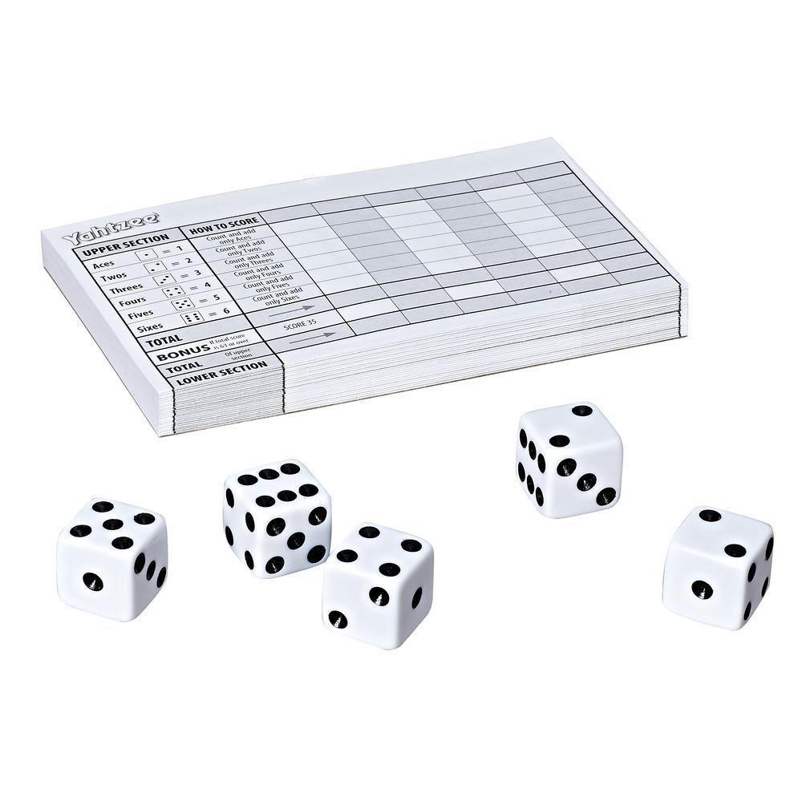

# Bob

Bob is an independent device that sees and senses the environment. It recognises objects and behavior based on what it has been taught. You use it in the field to collect the vision of things. The collected vision is turned into Machine Vision Models that 
allows you to create real-world puzzles and games. This allows you to create physical games to be played with family and friends
only limited by your imagination.

<family playing dice game>

It receives stereo video input over 2 x 2-lane MIPI CSI2. Additionally it receives sensor input over I2C
for distance, color, brightness. The sensor inputs are processed and disected to identify objects, people and
behaviour. Ziloo can connect over USB to make the output available on your Laptop, Phone or the Internet.

## Machine Vision Camera

Bob can be used to capture things out in the world to learn how to recognising them in the future. You can do this simply by pressing the camera button on the side. While the button is pressed images will be captured of the thing. As you capture a thing from different angles and in different conditions the coverage will increase.

You could use a Smartphone or Professional camera to capture your training images. But you should capture images with a setup similar to what the Vision Model will be seeing when used.

### Camera Remote Control

Using a bluetooth module you can control Bob with a Smartphone App for capturing Visions.

### Facing the camera

You can show Bob an object and turn it around. Bob will capture the vision of the object for you to have later.

## Physical Game Development Kit

Example Board game Monopoly
Bob Store for Apps
Tutorial Videos

## Speaker Bundle

The bundle comes with a speaker module that you plug into Bob. This allows Bob to speak.
It also comes with 2 voices that allow the games to easily generate speach as part of the game mechanics.

## Games Bundle

The bundle comes with an Multiplayer Module that you plug into Bob to connecting it with Bob elsewhere to allow you to play with
more people. 
It comes with 5 fun games to play in your livingroom and garden.

 
## Professional level Edge Machine Vision; Batteries Included

To get the precision in Machine Vision powerful hardware is needed to run modern ML Models made with PyTorch and TensorFlow.
To run this you typically get a Development board that costs $300 - $400 and then add camera modules that cost $75 - $200.
This gives you very raw power, but it isn't made to be run on batteries. It draws much too much power.
We have made Bob from the beginning aimed at single Lithium-Ion cell voltage, and made it good at detecting when the save on
battery.

## Unattended Mode

Bob can run unattended to capture interesting visions based on what is already known. This means that it needs good privacy, allowing you to review what has been captured before it is potentially uploaded to cloud services. This is why Bob isn't connected to the Internet or WiFi by default. It can be made to run unattended and automatically upload data, but in order to do so you must plug in the networking hardware.
